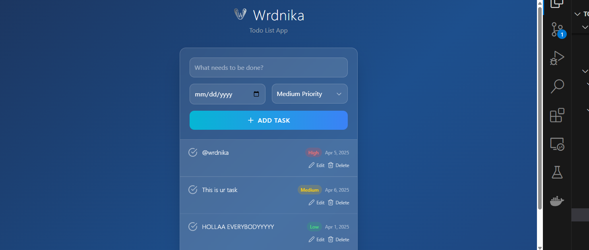

# ✅ To-Do List App

A **To-Do List App** built with **Vue 3**, **Vite**, and **Tailwind CSS**.  
This project is designed with a glassmorphism style, and includes powerful productivity features like priorities, deadlines, editing, reminders, and more.



---

## ✨ Features

- ✅ Add, Edit, Delete Tasks
- 🔁 Mark as Completed
- 🗓 Set Deadlines
- ⚡ Set Task Priority (High, Medium, Low)
- 🔔 Reminder & Notification Ready (WIP)
- 💅 Elegant Glassmorphism UI
- 📱 Fully Responsive

---

## 🚀 Tech Stack

- [Vue 3](https://vuejs.org/)
- [Vite](https://vitejs.dev/)
- [Tailwind CSS](https://tailwindcss.com/)

---

## 📦 Installation

```bash
# Clone the repo
git clone https://github.com/username/todo-vue-fancy.git
cd todo-vue-fancy

# Install dependencies
npm install

# Run the app
npm run dev
```
